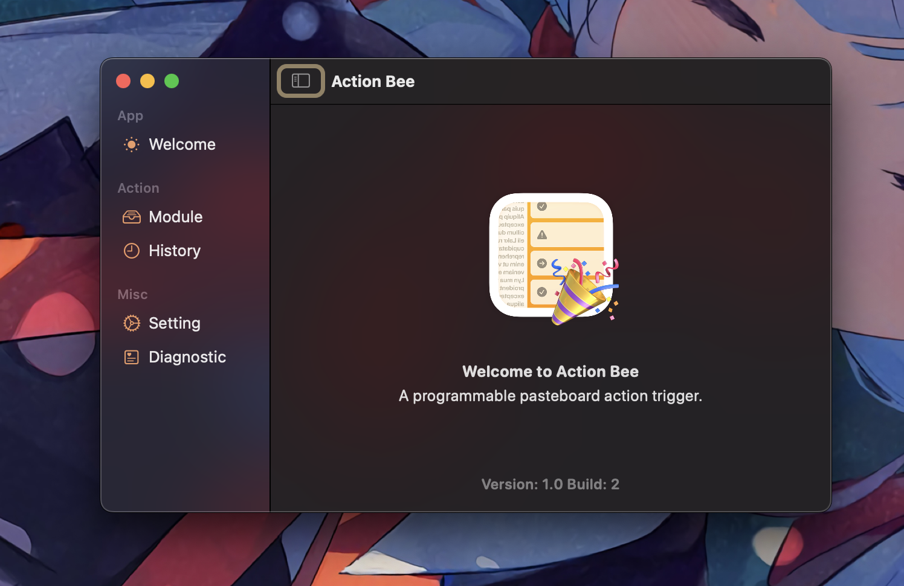
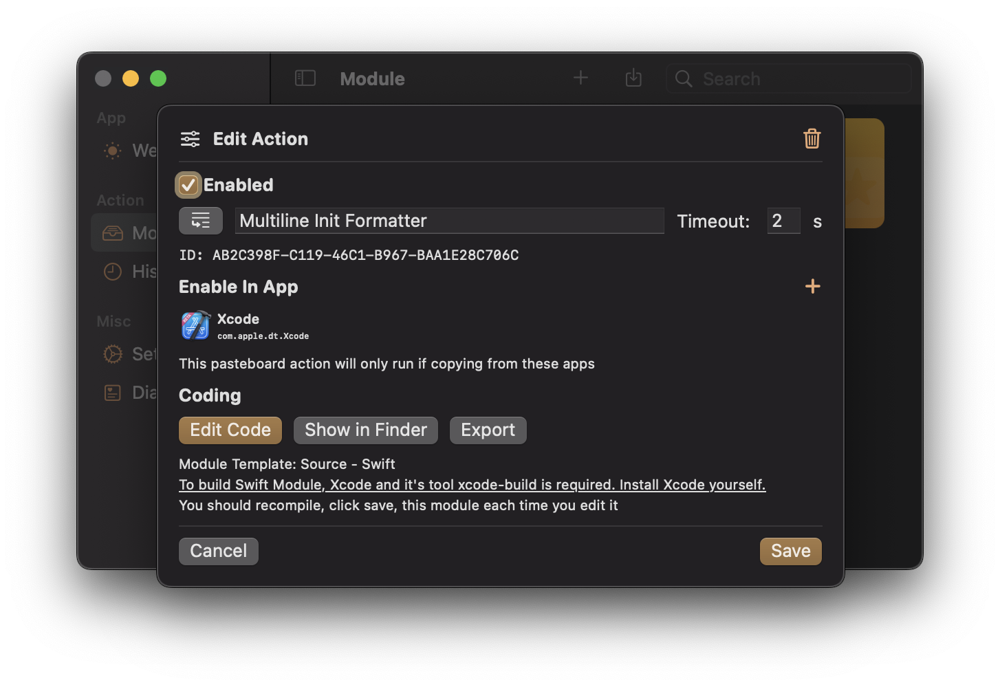

# ActionBee

ActionBee is a programmable pasteboard action trigger.

## Preview Video

It can be used to clean your URL in text. To see code or import this module, check out [here](./Resources/ModuleSample/Module%20Export%20-%20Link%20Cleaner/).

With Universal Control and iCloud Pasteboard, link cleaner will work across devices.

It can also be used to run the formator as follows. To see code or import this module, check out [here](./Resources/ModuleSample/Module%20Export%20-%20Multiline%20Init%20Formatter/).

## Action Module

We encourage you to develop an action module yourself. To see how a module gets to work, create one and check out the source. It is well documented inside the code.

Generically speaking, we pass your pasteboard data in the process's environment and spawn your module that is compiled as binary. At the end, we read back a recipe from stdout where you can define what to do.

## Warning

This app itself does not require access to your data or an internet connection, but the module you install may do. We do **not** use any sandbox to protect your data or privacy. **Only import modules come with source code and exam each line yourself before compiling or executing them.**

## Contributor

Made with love by [@Lakr233](https://twitter.com/@Lakr233), thanks to all my lovely friends for testing and being with me day and night.

## One More Thing

If you are looking for an Android alternative (which was made for cleaning URL), checkout [Tarnhelm](https://github.com/lz233/Tarnhelm) by [@lz__233](https://twitter.com/lz__233).

If you are looking for a great pasteboard manager, checkout [PasteNow](https://apps.apple.com/cn/app/pastenow-instant-clipboard/id1552536109) by [@tualatrix](https://twitter.com/tualatrix). I also recommend [Raycast](https://www.raycast.com/)'s built-in pasteboard manager if you are not a heavy user of it.

## License

Generically speaking, we do not hold responsibility for anything that happened on your computer, nor your data or privacy.

[License](./LICENSE)

---

Copyright © 2022 Lakr Aream. All Rights Reserved.
